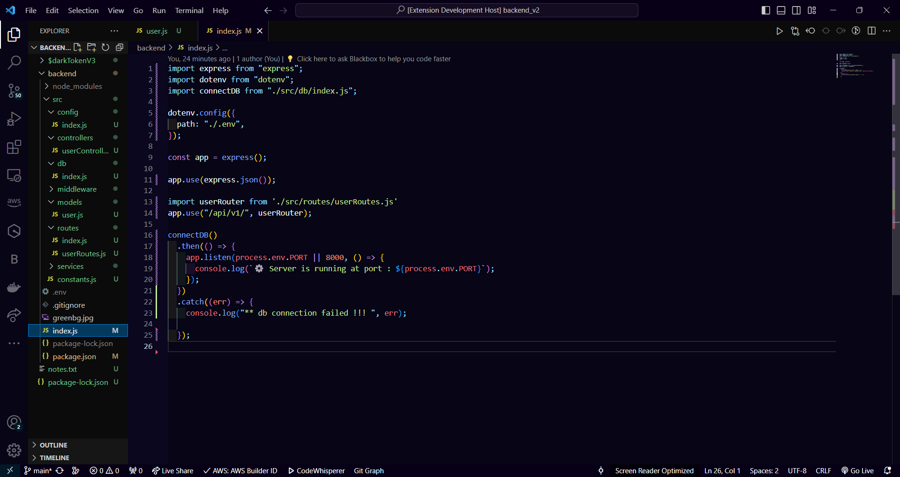

# Webpark Themes

Welcome to Webpark Themes, a comprehensive collection of 10 vibrant and modern color themes designed for an enhanced coding experience in Visual Studio Code. This extension provides multiple theme variants to suit different preferences and environments. Created by Aman.

## Available Themes

### 🌟 Webpark Primary (Default)
The original Webpark theme with a deep dark background and vibrant colors. Perfect for long coding sessions with excellent contrast and modern aesthetics.

### 🌙 Webpark Dark
A classic dark theme with balanced contrast and comfortable readability. Great for everyday development work.

### ☀️ Webpark Light
A clean and modern light theme with excellent readability. Perfect for bright environments and daytime coding.

### 🌆 Webpark Dimmed
A softer dark theme with reduced contrast for eye comfort. Ideal for low-light environments and extended coding sessions.

### ⚡ Webpark High Contrast
A high-contrast theme designed for accessibility and visibility in challenging lighting conditions. Excellent for users with visual impairments.

### 🎨 Webpark Monokai
A vibrant, high-contrast theme inspired by the classic Monokai palette. Features bold colors and excellent code readability for developers who love classic themes.

### 🧛 Webpark Dracula
A modern dark theme with purple and green accents, inspired by the popular Dracula theme. Perfect for web developers and modern coders.

### ❄️ Webpark Nord
A cool, arctic-inspired theme with soft blues and grays. Features a calming, professional appearance that's easy on the eyes during long coding sessions.

### 🌙 Webpark One Dark
A modern dark theme inspired by Atom's One Dark, featuring blue and green accents. Popular among modern developers for its clean, readable design.

### 🌸 Webpark Pastel
A gentle, soft theme with muted pastel colors. Perfect for developers who prefer a more subtle, calming coding environment without vibrant contrasts.

## Features

- **10 Premium Themes:** Choose from 10 carefully crafted themes to match your environment and preferences
- **Color Palette:** Carefully chosen palettes for visually appealing coding experiences
- **Easy on the Eyes:** Designed to reduce eye strain during long coding sessions
- **Modern Aesthetics:** Combination of carefully selected backgrounds and contrasting foregrounds
- **Accessibility:** High contrast option for better visibility
- **Developer Focused:** Themes designed for different coding styles and environments

## Installation

1. Open Visual Studio Code.
2. Go to the Extensions view (`Ctrl+Shift+X` or `Cmd+Shift+X`).
3. Search for "Webpark Themes" in the Extensions view search box.
4. Install the theme collection by Aman.

## Usage

Activate any Webpark theme by following these steps:

1. Click on the gear icon in the lower-left corner to open the Settings.
2. Choose "Color Theme" from the dropdown menu.
3. Select your preferred Webpark theme from the list:
   - **Webpark Primary** - The original vibrant theme
   - **Webpark Dark** - Classic dark theme
   - **Webpark Light** - Clean light theme
   - **Webpark Dimmed** - Soft dark theme
   - **Webpark High Contrast** - High contrast for accessibility
   - **Webpark Monokai** - Classic vibrant theme
   - **Webpark Dracula** - Modern purple/green theme
   - **Webpark Nord** - Cool arctic theme
   - **Webpark One Dark** - Modern blue/green theme
   - **Webpark Pastel** - Gentle pastel theme

### Quick Theme Switching
You can also use the Command Palette (`Ctrl+Shift+P` or `Cmd+Shift+P`) and type "Preferences: Color Theme" to quickly switch between themes.

## Screenshots

## Theme Recommendations

### By Environment
- **Bright Offices/Daytime**: Webpark Light, Webpark Pastel
- **Low-Light/Night Coding**: Webpark Dimmed, Webpark Nord
- **High Contrast Needs**: Webpark High Contrast
- **Modern Development**: Webpark Dracula, Webpark One Dark

### By Developer Type
- **Web Developers**: Webpark Dracula, Webpark One Dark
- **Backend Developers**: Webpark Monokai, Webpark Primary
- **UI/UX Designers**: Webpark Pastel, Webpark Nord
- **Accessibility Focused**: Webpark High Contrast
- **General Development**: Webpark Dark, Webpark Light

### By Preference
- **Vibrant Colors**: Webpark Primary, Webpark Monokai
- **Subtle Colors**: Webpark Pastel, Webpark Nord
- **Classic Themes**: Webpark Dark, Webpark Light
- **Modern Themes**: Webpark Dracula, Webpark One Dark
- **Eye Comfort**: Webpark Dimmed, Webpark Pastel

## Contributing

If you find any issues or have suggestions for improvements, feel free to open an [issue](https://github.com/amanjanaagal/webpark.git) or submit a [pull request](https://github.com/amanjanaagal/webpark.git) on GitHub.

## License

This theme collection is licensed under the [MIT License](LICENSE).

## Acknowledgments

Special thanks to the [Visual Studio Code](https://code.visualstudio.com/) team for providing a fantastic platform for developers.

**Enjoy coding with Webpark Themes!**
